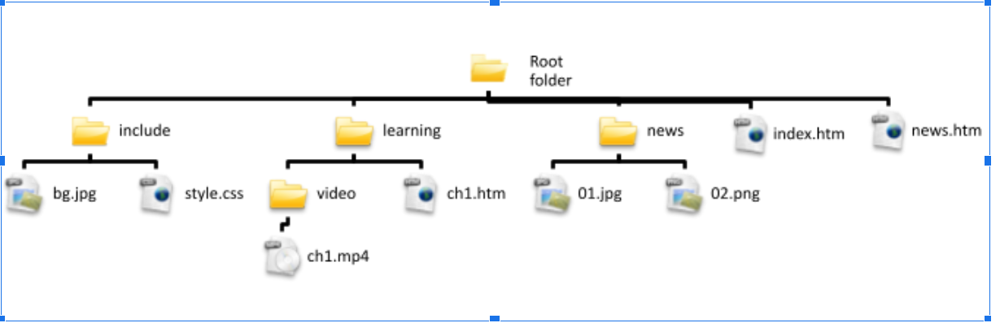

# Self-learning website

This is an ICT (Information and Communicating Technology) school based assessment project for my 2019 HKDSE (Hong Kong Diploma of Secondary Education) exam, under the elective titled Multimedia Production and Web Site Development.

The site is currently hosted [here](https://intezzz.github.io/SBA-self-learning/website/)

# Assessment guidelines

## Situation

ABC School is planning to provide a self-directed learning website. Below is the sitemap of the website:

_ABC School can be a secondary or primary school_

### Task 1 - Design & Implementation

Create a prototype of the web site with one or more web pages. The prototype should include

- a carousel to display updated news of the website
- a short learning video pr animation
- auto-graded tests created by dynamic web authoring technologies
- user-friendly navigation
- suitable layout designs for desktop computers and mobile devices

You may want to consider some of the following key factors when designing the prototype:

- web site structure
- audience awareness and friendliness
- sitemap
- the use to multimedia elements
- hardware, platform, language and colour compatibility
- web accessibility
- interactivity
- different web designs, such as print version and responsive design 

Create a presetation and/or documents to briefly describe the components involved in designing the prototype.

### Task 2 - Testing & Evaluation

Referring to the prototype of the web site (_Alternative: Using the prototype of a web site stipulated by your teacher), complete the following tasks.

Conduct a test of the prototype. Collect and record the feedback and results of the test.

Either 
1. make one major change in the web page design and illustrate the corresponding improvemnt,

or 
2. descripe how the scope of the prototype could be extended.

Create a presentation and/or documents to illustrate the web site. You may want to consider some of the following items:
- pros and cons of the web site design
- how the editing of the multimedia elements compromises the environmental factors of the web site 
- how the prototype addresses the key factors of a good web site
- how the evaluation helps improve the web site

## Project Report

Project report is linked [here](https://github.com/intezzz/SBA-self-learning/blob/main/README.pdf)
